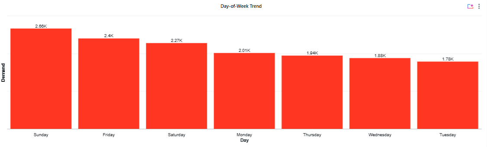
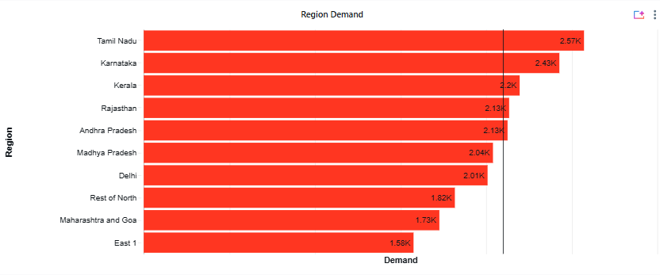
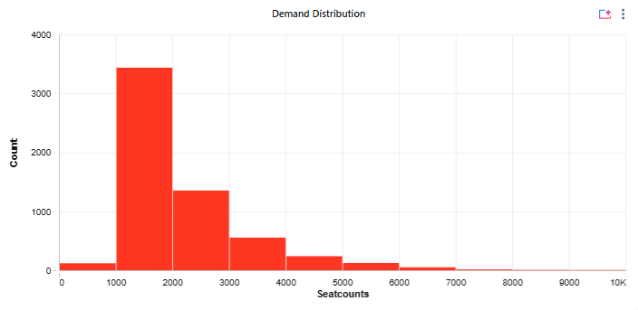
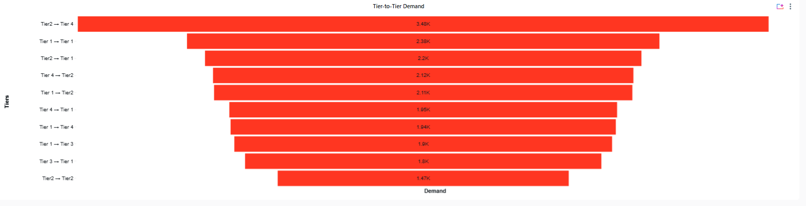

<div align="center">


# 🚍 RedBus Demand Forecasting

### Predict bus seat demand 15 days ahead — at scale, on Databricks

[](https://dbc-39149c56-eb5d.cloud.databricks.com/dashboardsv3/01f1221737401ca7b38a84ff7e0425f0/published?o=7474648096565651)

</div>

---

## 📌 Problem Statement

> **Forecast the final seat count of a bus journey, 15 days before departure.**

RedBus operates thousands of routes across India. The ability to predict demand 15 days ahead unlocks powerful levers — dynamic pricing, fleet reallocation, and proactive inventory management. This project builds an end-to-end ML pipeline on Databricks to solve that problem at scale.

---

## 🏗️ Architecture


The pipeline follows the **Medallion Architecture** (Bronze → Silver → Gold), moving raw S3 data through progressive transformation stages into ML-ready features — all orchestrated automatically via Databricks Jobs.

| Stage | Layer | Description |
|---|---|---|
| 📥 Ingest | **Bronze** | Raw data ingestion from AWS S3 |
| 🧹 Clean | **Silver** | Data transformation & quality checks |
| ⚙️ Engineer | **Gold** | Feature engineering & enrichment |
| 🤖 Train | **ML** | LightGBM training + MLflow tracking |
| 🔮 Predict | **Inference** | Batch inference on new data |
| 📊 Visualise | **Dashboard** | Databricks Analytics Dashboard |

---

## ⚙️ Tech Stack

| Tool | Purpose |
|---|---|
| **Databricks** | Unified analytics & ML platform |
| **PySpark** | Distributed data processing |
| **Delta Lake** | ACID-compliant data storage |
| **LightGBM** | Gradient boosting model for regression |
| **MLflow** | Experiment tracking & model registry |
| **AWS S3** | Raw data source |
| **Databricks Jobs** | Pipeline orchestration & scheduling |

---

## 🧠 Feature Engineering

Four categories of features were engineered to capture demand signals:

| Feature Group | Description |
|---|---|
| 📈 **Booking Intensity** | Rate of bookings relative to time-to-departure |
| 🔥 **Demand Pressure** | Seat occupancy pressure per route and date |
| 🔍 **Search Momentum** | Search-to-booking conversion trends |
| 🗺️ **Route Demand** | Historical demand patterns per origin-destination pair |

---

## 🤖 Model

- **Algorithm:** LightGBM (Gradient Boosted Trees)
- **Task:** Regression — predict final seat count (15-day horizon)
- **Evaluation Metric:** RMSE
- **Tracking:** All experiments logged in MLflow with parameters, metrics, and artifacts

---

## 📊 Dashboard Insights

> 🔗 [Explore the live Databricks Dashboard](https://dbc-39149c56-eb5d.cloud.databricks.com/dashboardsv3/01f1221737401ca7b38a84ff7e0425f0/published?o=7474648096565651)

### 📅 Day-of-Week Demand Trend



**Key Insight:** Sunday drives the highest demand (2.66K), followed by Friday (2.4K) and Saturday (2.27K). Weekends command ~33% more demand than the midweek trough (Tuesday: 1.78K). This pattern suggests a strong leisure/weekend travel behaviour — a direct trigger for weekend surge pricing and pre-emptive fleet scaling.

---

### 🗺️ Region-wise Demand



**Key Insight:** Tamil Nadu (2.57K) and Karnataka (2.43K) are the top demand regions, together accounting for a disproportionate share of total volume. South India dominates — TN, Karnataka, Kerala, and AP collectively outperform the rest of the country. Northern regions (Delhi, Rest of North) lag significantly, indicating untapped growth markets or structural supply gaps.

---

### 📦 Demand Distribution



**Key Insight:** Demand follows a strong right-skewed distribution. The 1,000–2,000 seat-count range dominates (~3,400 records), with very few routes exceeding 5,000 seats. This means the model must handle a long tail carefully — log-transformation or quantile-based approaches would help reduce RMSE on high-demand outlier routes.

---

### 🏙️ Tier-to-Tier Demand



**Key Insight:** **Tier 2 → Tier 4** is the single highest-demand corridor (3.48K) — surpassing even Tier 1 → Tier 1 (2.38K). This is a counter-intuitive and commercially important finding: smaller city pairs drive enormous volume, likely due to limited alternative transport. Tier 2 origin cities are systematically underserved despite being high-demand sources. Prioritising Tier 2 routes is the highest-ROI expansion strategy.

---

### 🏆 Top 10 Routes (from Dashboard)

| Rank | Route | Avg Demand |
|---|---|---|
| 1 | Karnataka → Tamil Nadu | 2,646 |
| 2 | Karnataka → Andhra Pradesh | 2,621 |
| 3 | Tamil Nadu → Tamil Nadu | 2,612 |
| 4 | Tamil Nadu → Karnataka | 2,580 |
| 5 | Andhra Pradesh → Karnataka | 2,488 |
| 6 | Kerala → Karnataka | 2,196 |
| 7 | Madhya Pradesh → Madhya Pradesh | 2,190 |
| 8 | Rajasthan → Delhi | 2,134 |
| 9 | Maharashtra & Goa → Madhya Pradesh | 2,107 |
| 10 | Andhra Pradesh → Andhra Pradesh | 2,087 |

---

## 🚀 Business Impact

| Use Case | How Forecasting Enables It |
|---|---|
| 💰 **Dynamic Pricing** | Adjust fares 15 days ahead based on predicted demand |
| 🗺️ **Route Optimisation** | Reallocate fleet capacity to high-demand corridors |
| 📦 **Inventory Planning** | Pre-book buses for predicted high-demand dates |
| 🔔 **Demand Alerts** | Trigger notifications when forecasted demand crosses thresholds |

---

## 🔁 Pipeline Orchestration

The entire pipeline — from S3 ingestion to dashboard refresh — is automated using **Databricks Jobs**. Each stage is a modular notebook job, scheduled to run on a cadence that ensures predictions are always available 15 days ahead of departure.

```
S3 Raw Data
    └── Bronze (Ingest)
         └── Silver (Clean)
              └── Gold (Feature Engineering)
                   └── LightGBM Training (MLflow)
                        └── Batch Inference
                             └── Analytics Dashboard
```

---

## 📁 Repository Structure

```
redbus-demand-forecasting/
├── notebooks/
│   ├── 01_bronze_ingestion.py
│   ├── 02_silver_transformation.py
│   ├── 03_gold_feature_engineering.py
│   ├── 04_model_training.py
│   └── 05_batch_inference.py
├── architecture.png
├── dashboard/
│   └── Redbus_Dashboard.pdf
└── README.md
```

---

## 👤 Author

**Sivakumar**
Built end-to-end on Databricks — from raw S3 data to a live forecasting dashboard.

[](https://linkedin.com)
[](https://dbc-39149c56-eb5d.cloud.databricks.com/dashboardsv3/01f1221737401ca7b38a84ff7e0425f0/published?o=7474648096565651)

---

<div align="center">
<sub>Built with ❤️ using Databricks · PySpark · LightGBM · MLflow · Delta Lake</sub>
</div>
