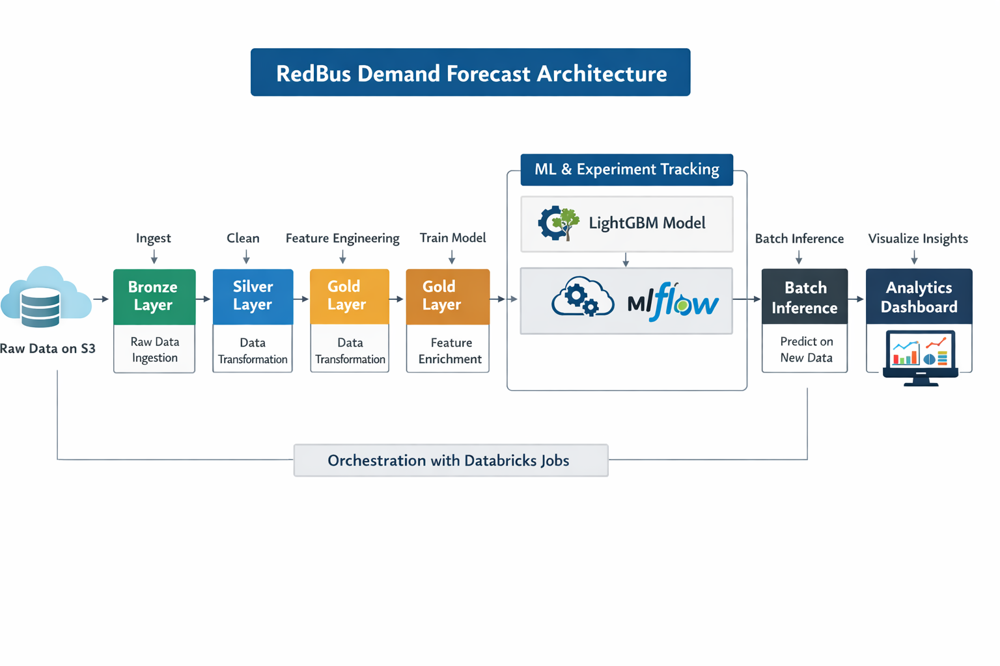

# 🚍 RedBus Demand Forecasting using Databricks

## 📌 Problem Statement
Forecast bus demand (final seat count) 15 days before journey.

## 🏗️ Architecture

## ⚙️ Tech Stack
- Databricks
- PySpark
- Delta Lake
- MLflow
- LightGBM

## 🔄 Pipeline
S3 → Bronze → Silver → Gold → ML → MLflow → Inference → Dashboard → Orchestration

## 🧠 Features
- Booking Intensity
- Demand Pressure
- Search Momentum
- Route Demand

## 🤖 Model
- LightGBM
- Evaluation Metric: RMSE

## 📊 Live Dashboard

Explore the interactive dashboard here:

🔗 https://dbc-39149c56-eb5d.cloud.databricks.com/dashboardsv3/01f1221737401ca7b38a84ff7e0425f0/published?o=7474648096565651

### Insights Provided:
- Top demand routes
- Weekend vs weekday demand
- Tier-to-tier demand analysis
- Region-wise demand patterns

This dashboard enables real-time exploration of demand trends and supports business decision-making.

## 🚀 Business Impact
- Dynamic Pricing
- Route Optimization
- Demand Forecasting

## 🔁 Orchestration
Automated using Databricks Jobs

## 📌 Author
Sivakumar
